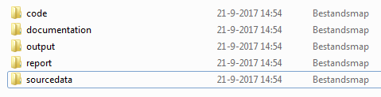

# Packages

We need a package to read in the excel files. I tend to make a Package section in each notebook, where I load all necessary packages. In this case we need the packages `readxl` and `tidyverse`. Load the packages:


```{r}
# Here your code


```


Because loading packages gives (standard) warnings and messages, we have suppressed messages and warnings as output by adding  `warning = FALSE, message = FALSE`  in the code chunk.


# Introduction

We will work with data in this course. In general the data will be supplied to you in the form of excel files (with extensions such as .xls or .xlsx) or as csv-file (with extension .csv). CSV (Comma Separate Values) are -loosely said- excel files without layout. It is possible to open csv files in excel and to save an excel sheet as .csv file.

As we will discover, csv files are more easy to work with.

In this course, we will focus on reading in excel and csv files. It is possible to read in other formats as well (e.g. SPSS and Stata and spatial data). 


# Folder structure

We advise you to do your analysis within a organized folder structure, e.g.:



This structure allows you to keep code, data and 'views' on the data (such as reports and slides) separate. The code we will use now is stored in the folder "code". The data needed are stored in the folder sourcedata. We do not need the other folders.


# Read csv-files

We saved our data in the folder 'sourcedata'. 

We will start with reading the contents of the _csv_ file _voetbal.csv_. This file contains data on the ranking of Dutch football teams.

We will use the command `your_dataframe <- read.csv2("file_name.csv")`.

_yourdataframe_ is the name that you give to the dataframe. In this example we will call the dataframe _football_.

However, this only works if the data file is located in the same folder as the notebook. In this case we have saved our data in the folder _sourcedata_ and the code in the folder _code_. Therefore, we need to tell `R` where to find the datafile. 

We can include the path in parameter *file_name*. In this example we tell `R` to go 1 folder up ('..') and then go to the correct folder _sourcedata_:

The folders are separated with foward slashes. Therefore, your command should look like:

`your_dataframe <- read.csv2("../sourcedata/file_name.csv")`


Assignment: read in the file "voetbal.csv" from the folder sourcedata and call the dataframe "football".


```{r}
# Here your code


```


By typing `football` we can view the data. Try to view the data.


```{r}
# Here your code


```


To just get an impression of the data frame we could either use `head(name of the data frame)` or `tail(name of the data frame)`. Try both


```{r}
# Here your code


```


```{r}
# Here your code


```


## a caveat

Try to read in the `N1.csv` as done above and call the dataframe football1 (we have added a 1, to make a differemnce:


```{r}
# Here your code


```


And have a look at the data with `head(football1)`


```{r}

# Here your code


```


All data seem to be stored in 1 cell!

CSV means 'Comma Separated Value'. At the time this format started to be implemented, observations were separated by a comma. In the Netherlands, a comma is often used a decimal point. Therefore, observations in the Netherlands tend to be separated by a semi column ';'.
`read.csv2()` is developed for the Dutch situation. 

So, if you store csv-files yourselves, you can use `read.csv2()`. If you are non-Dutch, you may want to use `read.csv()`

However, in many other countries a '.' is used as a decimal point and observations in csv files are separated by ','.

There are different solutions to this problem. The solution presented here, should always work. With the argument `sep` we can indicated with separator is used. In this case we can see that the comma is used as separator. 


Try the following code:

`football2 <- read.csv2("../sourcedata/N1.csv", sep=",")`

and view the data if it looks correct.


```{r}
# Here your code


```


```{r}
# Here your code


```


# Read Excel files

Often you will get your data in the form of an _Excel_ sheet. There are several packages available to read _Excel_ files in `R`. For this course, we will use the package `readxl`.

We will use the same data as above, only in a different format.
We have loaded the package `readxl` at the top of this notebook. using that package, the `Excel` sheet can be loaded.

Try to google how to read in the excel file *football.xlsx* in the folder sourcedata as a dataframe with the name *football_points* and use `head()` to view the data.


```{r}
# Here your code

```


Looking at the data, we see that the _Excel_ sheet is read in to a dataframe including empty rows and a column name "Eredivisie 2015/2016" that is not necessary and a strange column name "...2". We can repair this using the package `dplyr` (which is part of the package `tidyverse`), but we can also use the argument `skip` (just before the bracket). In this case we do not want to read the first 3 rows into our dataframe. So in this case you should add `skip = 3` to your command.


```{r}
# Here your code


```


## Read separate sheets

If you have opened the _Excel_ sheet, you might have noticed that it has two worksheets. We only read the first sheet, but we can also read the second worksheet:

```{r}
football_budget <- read_xlsx("../sourcedata/football.xlsx", sheet = "Budgets", skip = 3)
head(football_budget)
```


Note: instead of `sheet = "Budgets"`, we could have used `sheet = 2`


# Writing data

It is possible to write a dataframe as a _csv_ file by using the command `write.csv2()`. This is not often needed, because all the data editing is reproducible within the script. But sometimes you may want to write your dataframe as a _csv_ file and you can do that with:

```{r}

write.csv2(football, file = "../sourcedata/Myfootballdata.csv")

```

# The structure of the dataset

In `R`, there are only a few common types of data:

* `character` (strings)
* `numeric` (real numbers)
* `integer` (integer numbers)
* `complex` (complexe numbers, e.g. 2+3i, not often used)
* `logical` (binary `TRUE` / `FALSE` and `NA`)
* `factors` (categorical data: e.g. _male_, _female_)

And with the command `str(name_dataframe)` you will get the structure of your dataframe.

First, read in *gender.csv* from the folder *sourcedata* as a dataframe with the name `gender`


```{r}
# Here your code

```


and then check the structure of the dataframe `gender`


```{r}
# Here your code

```


## Change the structure of your dataframe

We can change the nature of the variables in several ways. Here we will show you a simple way.

Suppose you want to change the variable _Gender_ in to a string of characters and

```{r}
gender$Gender <- as.character(gender$Gender)
```


And suppose we want to change Number into a factor we can do this the same way:


```{r}
gender$Number <- as.factor(gender$Number)
```


By using `str()` again we can check if we succeeded:


```{r}
# Here your code


```


## A caveat!

Change the variable *Number* in to a new and numeric variable *Number1*. 
with

'gender$Number1 <- `

and then check the structure of your data and view the data


```{r}
# Here your code

```

```{r}
# Here your code


```


R returns a vector of 1's and 2's, because a vector of factor is not a vector of numbers, but a vector with _levels_. To do this correctly we need to change the factor into a _character_ vector first and then into a _numeric_ vector:

```{r}
gender$Number2 <- as.numeric(as.character(gender$Number))
gender
```


Tip: Please remember *never* change a factor variable directly into a numeric!


## Summary of the data

With the command `summary(name_dataframe)`, you will get a summary of your dataset:

Show the summary of the football dataframe


End of Notebook


