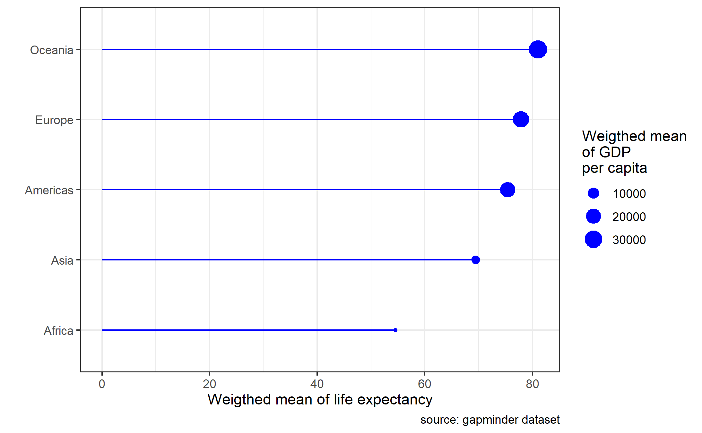
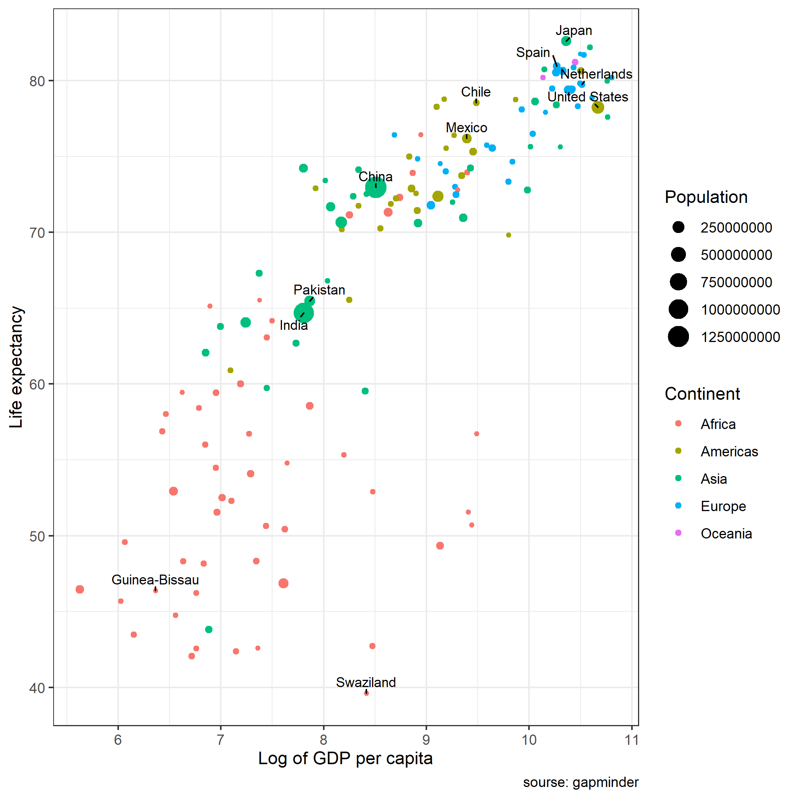

# Recapitulation of dplyr

We have done the data camp course "An Introduction to Tidyverse". In this course we learned some tools from the notebook dplyr. In this notebook we will work with dplyr to wrangle the data and make some nice plots.

This is a very short recapitulation of `dplyr`. Both `tidyr` and `dplyr` are part of the package `tidyverse`. `ggplot2` is also part of the _tidyversum_ (for a complete list, [see here](https://www.tidyverse.org/packages/)). With `dplyr` you can manipulate dataframes.

# The dplyr verbs

In package `dplyr` there are 5 _verbs_ that are really important:

1. `mutate()` creates new variables based on existing variables 
2. `select()` selects variables (columns). `select` allows you to rename variables as well: 
  `select(new_name = existing_name)`
3. `filter()` selects observations (rows) based on a  logic test)
4. `summarise()` reduces certain groups in a single value
5. `arrange()` changes the order of the observations

If you want guidance or help, you can use google or [this website](http://genomicsclass.github.io/book/pages/dplyr_tutorial.html).

In this notebook we will manipulate to make some plots. However, there will be some assignments just to practice with the dplyr verbs. 

# Packages


Of course we need to use the tidyverse package. 

We will use the gapminder dataset of the Gapminder organization. Gapminder was esthablished by Hans Rosling (and his family) to provide information about global health. 
You might enjoy watching this video of around 4 minutes to get a glimpse of the data and a possible visualization with the gapminder data:

[here](https://www.youtube.com/watch?v=0cXZv-8DiWA)

In this notebook we will not delve into animated or dynamic visualization.

The gapminder data are stored in a R-package "gapminder". Before loading the package for the first time, you need to install the package in the same way we installed the penguins package in the last lecture.

Please load the packages "tidyverse" en "gapminder". We also will use `ggrepel` 


```{r}
# Here your code


```


We will remove scientific notation in printing with this code:

```{r}
options(scipen=999)
```


# Summary data

We can get a first impression of the data by looking at the summary of the data.


```{r}

summary(gapminder)

```

We see that we have many (142) countries, 5 continents, years from 1952 until 2007, life expectancy, population and gdp per capita.

# Lineplot 1

Suppose we want to make a lineplot. First thing to notice is, that we have too many countries. 
Therefore, as a first plot we would like to compare the development of life expectancy over the year of the countries Netherlands, Belgium, Germany, France and United Kingdom.  

Assignment:

1. create a vector `Countries` with

`Countries <- c("Netherlands", "Belgium", "Germany", "France", "United Kingdom")`

2. create a dataframe with the name df1 based on the dataframe gapminder and select the rows ( _hint_: do not use the verb `select()` ) with the countries in the vector Countries


```{r}
# Here your code


```


If you have selected the countries mentioned you should now have a dataframe with the name df1 which contains 60 observations of 6 variables. 

Now we can make a lineplot of df1 with year on the x-axis and lifeExp on the y-axis and lines per country. Don't forget the add a nice theme.


```{r}
# Here your code


```


# Lineplot 2:

Suppose we want to make a lineplot with all countries with lines of the color "grey", except for the Netherlands that we would like to color with red.

One option is the make a new column (which we call Netherlands) that takes the value 1 if country equals the Netherlands and 0 otherwise. Furthermore, we would like to have the new column as a factor (to be able to use this column in the plot)

To do this we need to combine 3 things:

1. the dplyr verb `mutate()`
2. the statement `ifelse()`
3. and then make it a factor.


Ad 1: You have seen in the datacamp course how to use this verb
Ad 2: 

The `ifelse()` function tests a logical condition in its first argument. If the test is TRUE, ifelse() returns the second argument. If the test is FALSE, ifelse() returns the third argument.


Example:

```{r}
Student <- "Gertjan"


ifelse(Student == "Gertjan", "Yes, we are right", "No, we are wrong")

ifelse(Student == "Misja", "Yes, we are right", "No, we are wrong")


```

Ad 3


We can use the command as.factor() around the ifelse statement. So R will first execute the inner part of the mutate verb (which is the ifelese statment) and then make this variable a factor.

Assignment:

1. Make a new dataframe with the name df2
2. Make a new variable with the name Netherlands, which contains a factor with number 1 when country is equal to Netherlands and 0 otherwise


```{r}

# Here your code


```


Assignment: 
Make a plot with all countries have a grey line, except the Netherlands (which could have a red line).

_hint_ : if you will only use the aesthetic color for the variable Netherlands, your plot will look strange. You could add the aesthetic `group = country`
_hint_ : you can change the colors to the required colors with `scale_color_manual()`
_hint_ : you can change the "brightness" of the lines by adding an aesthetic alpha = Netherlands and then use scale `scale_alpha_manual(values = c("1"= 1, "0" = 0.3 ))` the control the transparency of the grey lines
_hint_ : don't forget to add a nice theme.


```{r}
# Here your code


```


# Intermezzo


## Assignment to practice with the verbs `select()`, `filter()` and `arrange()` 

1. make a dataframe with the name df3, based on the dataframe "gapminder"
2. select all columns which contains the letter "o" and the column "year"

_hint_: check `?select` for help if needed.

3. arrange df3 with the variable pop from high to low

4. make a new column `ranking` by adding a vector 1:length(country)

5. filter, so that you only keep the rows with raking 27 and 531 


```{r}
# Here your code


```


# Summarizing data

The summarise() function creates summary statistics for a specific variable in the data frame. For example, to compute the average life expectancy, apply the mean() function to the column lifeExp. 

The function would look like this

`summarise(MEAN_lifeExp = mean(lifeExp))`.

We can also compute these summary statistics per group. In our case the group could be country (since we have multiple countries), year (since we have multiple years) or continents.

Other summary statistics include

- sum()
- min()
- max()
- quantile()
- median()
- sd() 
- n() (the length of vector) 
- n_distinct() (number of distinct values in variable)


Assignment:

1. Make a dataframe with the name df4 based on gapminder
2. Filter the observations of the year 2007
3. Create (with summarise) the variables Mean_LE (which is the weighted mean of life expectancy with weights the population per country) and Mean_GDP (which is the weighted mean of the gdp per capital with weights the population per country)
4. Arrange the dataframe with the continents with the highest Mean_GDP first.


```{r}
# Here your code


```


You will get a "friendly warning":

`summarise()` ungrouping output (override with `.groups` argument)

You can look here for more information, and how to get rid the friendly warning.

https://stackoverflow.com/questions/62140483/how-to-interpret-dplyr-message-summarise-regrouping-output-by-x-override


## Plot 1


Assignment: make a plot with df4 as seen below.





_hint 1_: You may notice that despite the fact that we arranged the data in df4, your plot has a different order than the example above. `arrange()` does not carry over the plots. So in this case we had to reorder the y-axis on the plot as well. ?reorder might be helpfull.
_hint 2_: We have different layers in the plot. 1 is `geom_point()`, the other is `geom_segment()`
Check ?geom_segment or just google.
_hint 3_: You need to change some labels. To get the line breaks in the legend, please google.


```{r}
# Here your code


```


# Assignment

Please create this plot 


Hints:

1. You could make 2 data frames: 1 with all countries without a label and 1 with countries with a label
2. Use 2 times geom_point() to plot these points
3. The labels can be added with the package ggrepel


```{r}
# Here your code


```


# End of notebook
