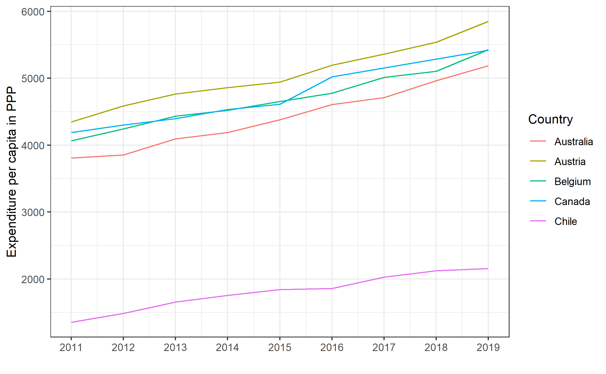
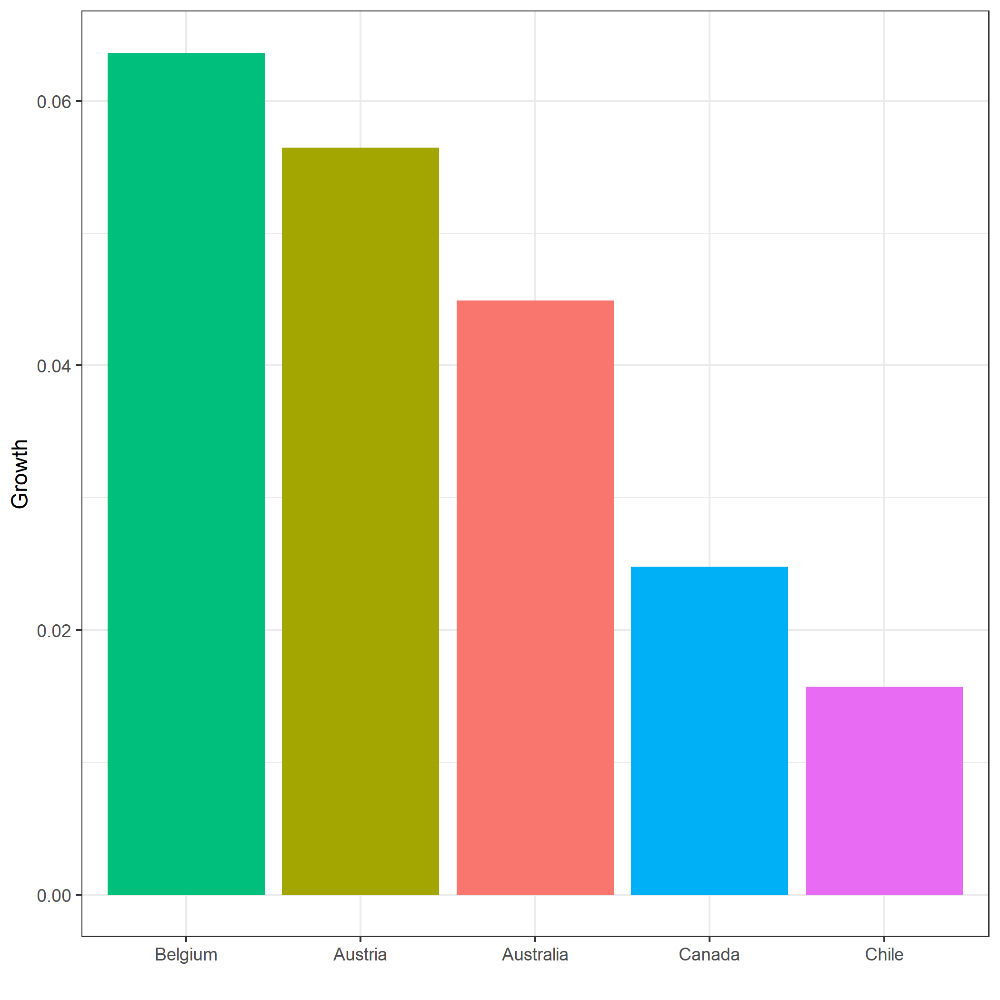

# Introduction


# Packages

We need the packages tidyverse and readxl.

Assignment: 

Load these packages:


```{r}
# Here your code

```


# Merging data


## Introduction


In many cases you need to merge data from two or more data frames. In this notebook we will show you how that can be done using only a few powerful commands.

Commands that can be used for merging are:

* `merge()`
* `join()` (from package `dplyr`).
* `rbind()`  en `cbind()`.


## Dataframes

First we construct two small `data.frame`'s. Because they are small, the effects of the different merge commands can be easily observed.


```{r}

# Run this code

data1 <- data.frame(
  Hospital = c("Gigant", "Moloch", "Mega"),
  Revenue = c(100, 95, 90),
  stringsAsFactors = FALSE
)

print(data1)


```

```{r}

# Run this code 

data2 <- data.frame(
  Hospital = c("Gigant", "Moloch", "Maverick"),
  Profit = c(10, 11, 5),
  stringsAsFactors = FALSE
)

print(data2)

```

As you will notice these firms have 1 variable in common (Hospital) and 1 different variable each (data1: Revenue and data 2: Profit). Furthermore these dataframes have 2 observations in common (Giant and Moloch) and 1 different observation each (data1: Mega and data2: Maverick). 


## Merging

We can now merge the two dataframes.

# using the command `merge()`

Will start with the command `merged_dataframe <- merge(your_first_data_frame, your_second_dataframe, by = the_key)`. 

Try to do this and look at the result:


```{r}
# Here your code

```


As you will probably notice: the command `merge()` only returns the hospitals that are part of both data frames. Please note that when you use merge you only get returned the data that both data frames in common.

## The `join` command of `dplyr`

We advise you to use the join commands of `dplyr`.  With these commands it's easier to control what happens during a merge.

### full_join

Try `merged_dataframe <- full_join(your_first_data_frame, your_second_dataframe, by = the_key)` and inspect the result:


```{r}
# Here your code


```


When you use `full_join()`, all data points from both dataframes will be merged. Missing values will be represented by `NA`'s .

### inner_join

Now try the command  `inner_join()` and inspect the results:


```{r}
# Here your code

```


`inner_join` is comparable to the command `merge()`.

### left-join 

Inspect the results of `left_join()` and try to see what happens if you change the order of your dataframes before merging the data.


```{r}
# Here your code


```


#### right-join

Try `right_join()` as the mirror of `left_join()` and inspect the result.


```{r}
# Here your code


```


### Information about missings

There are 2 special functions that tell you something about the merged data.

#### anti-join

Inspect the results of `anti_join()`


```{r}
# Here your code


```


The command `anti_join` returns the hospitals that are present in the first dataframe, but not in the second. When you want to know which hospitals are present in the second, but not in the first dataframe, you can just switch the order of the dataframes.

#### semi-join

The `semi_join()` command returns all hospitals present in the first and the second dataframe.


```{r}

# Here your code


```


## rbind en cbind

Finally, the commands `cbind()`(column bind) and `rbind()` (row bind) are useful for adding data. Only use these commands when you are sure about the effects. Generally, we advise you not to use these commands.

## cbind

With `cbind()` you paste the data from the second data as a new column to the first dataframe. Please: `cbind()` does not match! Which means that the order of the data is important.

To illustrate this we will first change the order of the second dataframe

```{r}
data2a <- data2 %>%
  arrange(-Profit)
print(data2a)
```


And now try to use `name_of_your_merged_dataframe <- cbind(data1, data2a)`


```{r}
# Here your code


```


## rbind

With the command `rbind()` you paste the data from the second dataframe under the data of the first dataframe. The second dataframe needs the same columns as the first dataframe. To illustrate this, we will first create some new data.


```{r}
data1a <- data.frame(
  Hospital = c("Giga"),
  Revenue = c("1000")
)
print(data1a)
```


Now try to paste the second dataframe to the first one, using `rbind()`.


```{r}
# Here your code


```


# From wide to long (and back again)

## Introduction


In many cases you will get your data in a format that you want to change. In this section we will learn how to change the format of your data frames.


## From wide to long


Assignment:

We will now read in a dataset that you will often encounter. 

1. Please read in the sheet "Curr exp, per capita US$PPP" from 
OECD-Health-Statistics-2020-Frequently-Requested-Data.xls in the source data folder

_hint_: use `skip` to get the years as column headers

_hint_: R gives a friendly warning

New names:
* `` -> ...1
* `2019` -> `2019...51`
* `` -> ...52
* `2019` -> `2019...53`

This warning indicates that R gives new names to columns without a name and adds something columns with the same name.


2. rename the column "...1" to Country and the column "2019...51" to 2019


_hint_: Because R has difficulties with numbers as column headers, put `` around column names with numbers, spaces etc. So column 2019 would be `2019`


3. select the columns 2011 to 2019

_hint_: see hint above


4. Filter the first 5 rows of the dataframe (i.e. Australia to Chile)


_hint_: You could use `filter()`, however in this case `slice()` could be a good option.


```{r}

# Here your code


```


We now have 5 observations with 10 variables.


Suppose that we we would like to make this plot:



The most easy way is to transform our data frame to the format

| Country   | Year | Expenditure |
| Australia | 2011 | 3809.112    |
| Australia | 2012 | 3854.190    |


Then we could just have a ggplot with x = Year, y = Expenditure and color = Country.


We can make this data frame from wide to long with the function `pivot_longer()`.

This function takes as arguments:

- `cols = ` in which you specify the columns that should be changed
- `names_to = "your name for a variable"` 
- `values_to = "your name for the content of the cell"`


Assignment:

1. Change the data frame df1 from a wide format to a new "long" data frame df2 with the columns Country, Year and Expenditure.

_hint_: Remember that colum names with numbers should be written as `2011` to prevent confusion


```{r}

# Here your code


```


Assignment: 


Recreate the plot as shown above

_hint 1_: with your first try you might get this warning above your plot

"geom_path: Each group consists of only one observation. Do you need to adjust the group aesthetic?"

This means that R does not know how to connect the dots. This is because the variable "Year" is a character variable. (Check this with `str(df2)`)

There are 3 ways to solve this problem:

a. You can change the character variable to an integer with the code

`df2$Year <- as.integer(df2$Year)`

b. You can change Year to an integer in the ggplot function

`ggplot(data = df2, aes(x = as.integer(Year), y = Expenditure,  color = Country))`

c. you can add (as the warning suggests: group = Country to the plot)

`ggplot(data = df2, aes(x = Year, y = Expenditure, group = Country,  color = Country)) 

_hint 2_:  

Since Year is an integer, the numbers on the x-axis show 2012.5, 2015.0 and 2017.5. We want to change this to a sequence of 2011 to 2019. You can do this by using the function:
`scale_x_continuous()` with the argument `breaks =`


_hint 3_:

Don't forget change the labels and the x-axis and choose a theme of your liking.


```{r}
# Here your code


```


## From long to wide


Assignment:

Make a new data frame df3, based on df2 with only the observations of the year 2018 and 2019.


```{r}

# Here your code


```


Suppose we would like to know the growth factor ((the expenditure of 2019 minus the expenditure 2018)/the expenditure of 2019). 
In this case it would be handy to have a data frame that looks like

| Country   | 2018     | 2019     |
| Australia | 4964.533 | 5187.419 |
| Austria   | 5538.347 | 5851.055 |


We can use the function `pivot_wider()` 

This function takes

`names_from = `
`values_from = `

Assignment:

Make a new wide data frame df4 which looks like table above based on the long data frame df3. 


```{r}
# Here your code


```


Assignment:

Make a new column "Growth" based on the formula (`2019` - `2018`)/`2018`

_hint_ note the `` around the variable names.


```{r}
# Here your code


```


Assignment:

Recreate this plot:




```{r}
# Here your code


```


End of notebook


