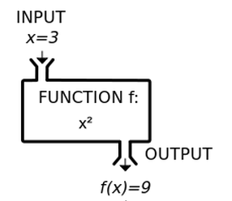

# Packages

For this notebook we need the  `tidyverse` package (which should already be installed) .

```{r}
# Your code here

```


# Functions

`R` is built with functions. By running commands from different packages, you use functions (often without knowing it). 
Functions are the building blocks of 'R' to automate things that need to be repeated. 

It is useful to master the use of functions in your own code, this becomes especially important with larger and more complex analyses.

# Exploring existing functions

First, lets take a look at a function you probably have used before, the `mean()` function.

The `mean()` function has three *arguments*:

* `x`,  a vector of numbers for which we want to calculate the mean. 
* The second argument is `trim`, an optional argument that tells `mean()`  to ignore some of the numbers we feed it
* `na.rm` , an optional argument that tells `mean()` to remove all missing values before calculating the mean.

So how do we know what the arguments of a function are? Simply by typing its name with a question mark in front of it.

```{r}
?mean
```

You can see that the `trim` and `na.rm` arguments are already provided with default values. This means that if we do not specify them, the defaults are used.


```{r}
my_data <- c(1,2,3, NA)

mean(my_data)

mean(my_data, na.rm = FALSE)

mean(my_data, na.rm = TRUE)
```


## Exercise 1: 

Find out what the arguments are for the `sum()` function. Which arguments are required, and which are optional?


## Exercise 2:

Study the arguments of the `log()` function.

Predict which of the following calls will work.

> log(x = 100, 10)
> log(100)
> log(base = exp(1))
> log(exp(1)^3, exp(1))
> log(base = 10, x = 100)

Then test your predictions by running the function calls in the R chunk below.

```{r}
# log(x = 100, 10)
# log(100)
# log(base = exp(1))
# log(exp(1)^3, exp(1))
# log(base = 10, x = 100)
```


There is a simple way to conceptualize a function: as a black box that takes input, processes the input (transforming it) and returning output. 



# Making your own functions

By using the `function` command we can create our own functions.

Let us make the function depicted above:

a function that accepts a vector `x`  and returns the square of the vector.

``` {r}
square <- function(x){
  x * x
}
```

The function `square` returns the squares of the elements of an input vector `x`:

```{r}
a <- 3
square(a)

b <- c(1, 3)
square(b)
```

The last example clearly shows that in `R` all variables are a vector. 
This may take some getting used to for a user, but it will soon become clear that this is one of the strong points of the `R` language. 
It ensures that code is compact and speeds up large operations.

As we already have seen with the functions `mean()` and `log()` above, you can also pass multiple arguments to a function:

```{r}
square_plus <- function(x, y = 1){
  x * x + y
}

# use 2 arguments
square_plus(3, 5)

# use the default for the second argument
square_plus(3)
```

So this function has two 'input' variables and returns a single 'output'. 
As you can see the second argument has a _default value_ which is used if nothing is entered.

## Exercise 3

Create a function `paste_together` that takes two variables as 'input' and pastes it together with the internal function `paste`.

```{r}
# function 'paste_together' can paste two strings together
paste_together <- function (...) {

# your code here
  
}

# Test your function by excuting the code below

# paste two variables and create a new string
paste_together("house number", 110)

# use a vector for one of the arguments
paste_together("letter", LETTERS)

```


Before we practice more with functions, let's introduce another important concept in programming, the *for loop*.

# For loops

From Wikipedia:

*In computer science, a for-loop (or simply for loop) is a control flow statement for specifying iteration, which allows code to be executed repeatedly.*

*...*

*A for-loop has two parts: a header specifying the iteration, and a body which is executed once per iteration. The header often declares an explicit loop counter or loop variable, which allows the body to know which iteration is being executed. For-loops are typically used when the number of iterations is known before entering the loop.  *

Example code in R:

```{r}
for (i in 1:10){
  print(i)
}
```


## Exercise 4

Create a function that for the numbers _x_ to _x + 10_ calls the function `squared_plus()` and adds the results.

> Hint: use a _for loop_ within the function.

```{r}
# my cool new function
# my_func <- function(x){
#
# total <- 0
#
# for (...) {
# total <- ...
#}
#
# total # return total
#}

# test your new function
# my_func(2)
```


# Exercise 5

The variance of a set of numbers X is a **statistic** (a number that is derived from other numbers using a statistical procedure or algorithm) that quantifies the amount of spread in the values. Informally, it measures how far a set of numbers is spread out from their average value. 

$Variance(X) = mean(X^2) - (mean(X))^2$

Create a function that calculates the variance of a vector of numbers.

Test your function on the vector `vec` .
It should return the same answer as the R built-in command `var`, after you apply `Bessels correction` . This correction is simply multiplying your answer by N/(N-1), where N the length of vec (i.e. how many numbers the vector contains).

```{r}
vec <- c(2, 4, 6, 9)
```

```{r}
# my cool new function
my_func <- function(x){
  # your code here
}

# test your function, 
N <- length(vec)
corr <- N/(N-1)

my_func(vec) * corr 

# should be equal
var(vec) 
```


# When do I use functions?

When you are starting out, a good "signal" of when to use a function is **code repetition**.
As soon as you start copying a block of code multiple times and changing only one of two things, it is time to think about using a function.

For example, suppose we are interested in global export of clothing in 2018. 
Which countries are top exporting countries, and to which countries do they export to.

# Exercise 6

The folder `sourcedata` contains a dataset `clothing_exports_aggregated.rds`.
Use `readRDS()` to read in the dataset, and use the commands you learned earlier in the course to select only the year 2018.
How many distinct reporter countries does your filtered dataset contain?

```{r}
# your code here
```


Lets start with China, the country that has the largest clothing exports.

```{r fig.width = 10, fig.height = 4}
df_tmp <- df_2018 %>% filter(reporter_iso == "chn") %>% 
  group_by(year) %>% slice_max(order_by = export_value_usd, n = 5)

# extract country name from dataset
country_name <- unique(df_tmp$reporter_fullname_english)

plot_title <- paste("Top five countries that", country_name, "exports clothing to")

ggplot(df_tmp, aes(x = reorder(partner_fullname_english, export_value_usd), y = export_value_usd)) +
  geom_point() +
  expand_limits(y = 0) +
  ggtitle(plot_title) +
  xlab("Importing country") +
  ylab("Export value (x billion dollars)") +
  coord_flip()

```

Now suppose we want to make such a plot for a list of countries. Say we are interested in India ("ind"), Bangladesh ("bgd"), Italy ("ita") and Germany ("deu") as well.
We could of course copy the code above, and vary the country code to match each of the countries.

This might work for a few countries, but it quickly becomes tedious, and because of all the repetition, we end up with notebooks with a lot of very similar code.

And what if we decide to change our graph later on?
We would need to change ALL copies of the graph. This is error prone, and no fun.

So let us turn the code block into a function. 

What does the function need? It needs a name, and arguments.

For a name, it must be not too short, and not too long.

For its arguments, we need two: a dataset, and it needs a country code.

## Exercise 7

Turn the previous code chunk into a function that takes the dataset and a country code as arguments, and creates the plot for the supplied country code.

```{r}
plot_top_five_receiving_countries(...){
  # code from the previous chunk adjusted to deal with any given country code
}
```


Let's see if it works by creating the plot for Germany.

```{r fig.width= 8}
plot_top_five_receiving_countries(df_2018, country_code = "deu")
```

Now that we have our function, we still have to call the function for each country separate. How can we call the function multiple times, so that it creates a plot for each of our five countries? We use a **for-loop**.

If we specify the list as a vector, we can use the for-loop to execute our plotting function repeatedly, for each element of the list of country names.

```{r}
countries <- c("chn", "bgd", "deu", "ita", "ind")
```

# Exercise 8

Write a for loop that calls the `plot_top_five_receiving_countries()` function for each country in `countries`. Use the `length()` function to obtain the number of times the loop needs to be executed. 

N.b. Normally output from `ggplot()` is not printed when code is executed inside a for loop. 
You can use the `print()` function to force the output created inside the for loop to be printed on screen.

```{r}
# your code here
```


# Further reading on functions in R (Optional)

https://www.datacamp.com/community/tutorials/functions-in-r-a-tutorial

https://r4ds.had.co.nz/functions.html


End of Notebook
